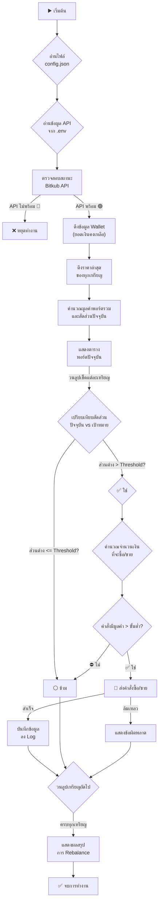

# 🤖 Bitkub Rebalance Bot

สคริปต์ Python สำหรับการปรับสมดุลพอร์ตการลงทุน (Rebalancing) ในบัญชี Bitkub ของคุณโดยอัตโนมัติ สคริปต์จะทำงานโดยการเปรียบเทียบสัดส่วนสินทรัพย์ปัจจุบันกับเป้าหมายที่คุณกำหนดไว้ในไฟล์ `config.json` และจะทำการซื้อหรือขายสินทรัพย์เพื่อให้พอร์ตของคุณกลับมาสมดุลตามที่ต้องการ

## ✨ คุณสมบัติเด่น

- **📈 Real-time Portfolio Tracking**: ดึงข้อมูลยอดเงินคงเหลือและราคาตลาดล่าสุดจาก Bitkub API โดยตรง
- **⚖️ Automated Rebalancing**: คำนวณและส่งคำสั่งซื้อ/ขาย (Market Order) โดยอัตโนมัติเพื่อปรับสัดส่วนพอร์ตให้ตรงตามเป้าหมาย
- **🛡️ Safe Dry Run Mode**: โหมดทดลองที่ให้คุณสามารถเห็นการทำงานของบอทได้โดย *ไม่มี* การส่งคำสั่งซื้อขายจริง เหมาะสำหรับการทดสอบและตั้งค่า
- **⚙️ Flexible Configuration**: กำหนดเป้าหมายพอร์ต, API Keys, และค่าพารามิเตอร์ต่างๆ (เช่น Threshold) ได้อย่างง่ายดายผ่านไฟล์ `config.json` และ `.env`
- **📝 Transaction Logging**: บันทึกประวัติการทำธุรกรรมทุกครั้งลงในไฟล์ `trade_log.csv` เพื่อให้สามารถตรวจสอบย้อนหลังได้
- **📊 Clear Reporting**: แสดงผลสรุปพอร์ตก่อนและหลังการ Rebalance, รายการธุรกรรม, และสรุปผลกำไร/ขาดทุนผ่านตารางที่สวยงามใน Console
- **☁️ Google Sheets Integration**: (ทางเลือก) สามารถบันทึกข้อมูลทั้งหมดลงใน Google Sheets เพื่อการวิเคราะห์ข้อมูลที่ซับซ้อนยิ่งขึ้น

---

## 🌊 แผนภาพการทำงาน (Workflow)



---

## 🛠️ การติดตั้งและตั้งค่า

### 1. เตรียมไฟล์และ Dependencies

- **Clone Repository:**
  ```bash
  # หากยังไม่ได้ clone project
  git clone <your-repository-url>
  cd <repository-folder>
  ```

- **ติดตั้ง Libraries ที่จำเป็น:**
  ```bash
  pip install -r requirements.txt
  ```

### 2. ตั้งค่า API Keys

สร้างไฟล์ `.env` ในโฟลเดอร์โปรเจกต์ (หากยังไม่มี) และนำ API Key และ API Secret ที่ได้จาก Bitkub มาใส่:

```env
# .env
BITKUB_API_KEY="YOUR_API_KEY_HERE"
BITKUB_API_SECRET="YOUR_API_SECRET_HERE"
```

> **ความปลอดภัย**: ไฟล์ `.gitignore` ในโปรเจกต์นี้มีการตั้งค่าให้ละเว้นไฟล์ `.env` อยู่แล้ว เพื่อป้องกันไม่ให้ API Keys ของคุณหลุดขึ้นไปบน Git

### 3. ตั้งค่ากลยุทธ์พอร์ต

เปิดไฟล์ `config.json` เพื่อกำหนดสัดส่วนของแต่ละสินทรัพย์ที่คุณต้องการลงทุน

- **`target_allocations`**: กำหนดสัดส่วนเป็นเลขทศนิยม **(ผลรวมทั้งหมดต้องเป็น 1.0)**

**ตัวอย่าง `config.json`:**
```json
{
  "target_allocations": {
    "THB": 0.10,  // 10% ของพอร์ต
    "BTC": 0.50,  // 50% ของพอร์ต
    "ETH": 0.40   // 40% ของพอร์ต
  }
}
```
> **สำคัญ:** ต้องมี `"THB"` อยู่ใน `target_allocations` เสมอ แม้จะมีค่าเป็น 0 ก็ตาม

### 4. ตั้งค่าการทำงานของสคริปต์

คุณสามารถปรับพฤติกรรมการทำงานของบอทได้โดยตรงในไฟล์ `rebalance.py`:

- **`DRY_RUN`**: 
  - `True`: **(แนะนำสำหรับครั้งแรก)** โหมดทดลอง จะไม่ส่งคำสั่งซื้อขายจริง
  - `False`: โหมดทำงานจริง
- **`SAVE_TO_SHEET`**: 
  - `True`: เปิดการใช้งานการบันทึกลง Google Sheets (ต้องตั้งค่า `credentials.json`)
  - `False`: ปิดการใช้งาน
- **`THRESHOLD`**: กำหนดความคลาดเคลื่อนที่ยอมรับได้ก่อนที่บอทจะเริ่ม Rebalance (เช่น `0.01` หมายถึงจะเริ่มทำงานเมื่อสัดส่วนต่างจากเป้าหมายเกิน 1%)

---

## 🚀 เริ่มใช้งาน

เมื่อตั้งค่าทุกอย่างเรียบร้อยแล้ว สามารถรันสคริปต์ได้ด้วยคำสั่ง:

```bash
python rebalance.py
```

บอทจะเริ่มทำงาน แสดงข้อมูลพอร์ต, ดำเนินการปรับสมดุล, และรายงานผลสรุปให้คุณทราบ

---

## ⚠️ คำเตือน

> การลงทุนในสินทรัพย์ดิจิทัลมีความเสี่ยงสูงและอาจส่งผลให้เกิดการสูญเสียเงินทุน ผู้ใช้งานควรศึกษาข้อมูลและทำความเข้าใจการทำงานของสคริปต์อย่างละเอียดก่อนการใช้งานจริง ผู้พัฒนาไม่มีส่วนรับผิดชอบต่อความเสียหายหรือผลขาดทุนใดๆ ที่เกิดขึ้นจากการใช้โปรแกรมนี้ โปรดใช้งานด้วยความระมัดระวังและยอมรับความเสี่ยงด้วยตนเอง