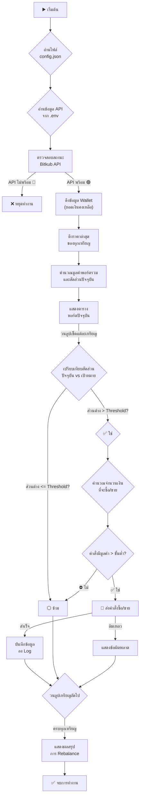

# 🤖 Bitkub Rebalance Bot

## **Repository Link:** [https://github.com/abe27/bot-rebalance-bitkub.git](https://github.com/abe27/bot-rebalance-bitkub.git)

สคริปต์ Python สำหรับการปรับสมดุลพอร์ตการลงทุน (Rebalancing) ในบัญชี Bitkub ของคุณโดยอัตโนมัติ สคริปต์จะทำงานโดยการเปรียบเทียบสัดส่วนสินทรัพย์ปัจจุบันกับเป้าหมายที่คุณกำหนดไว้ในไฟล์ `config.json` และจะทำการซื้อหรือขายสินทรัพย์เพื่อให้พอร์ตของคุณกลับมาสมดุลตามที่ต้องการ

## ✨ คุณสมบัติเด่น

-   **📈 Real-time Portfolio Tracking**: ดึงข้อมูลยอดเงินคงเหลือและราคาตลาดล่าสุดจาก Bitkub API โดยตรง
-   **⚖️ Automated Rebalancing**: คำนวณและส่งคำสั่งซื้อ/ขาย (Market Order) โดยอัตโนมัติเพื่อปรับสัดส่วนพอร์ตให้ตรงตามเป้าหมาย
-   **🛡️ Safe Dry Run Mode**: โหมดทดลองที่ให้คุณสามารถเห็นการทำงานของบอทได้โดย _ไม่มี_ การส่งคำสั่งซื้อขายจริง เหมาะสำหรับการทดสอบและตั้งค่า
-   **⚙️ Flexible Configuration**: กำหนดเป้าหมายพอร์ต, API Keys, และค่าพารามิเตอร์ต่างๆ (เช่น Threshold) ได้อย่างง่ายดายผ่านไฟล์ `config.json` และ `.env`
-   **📝 Transaction Logging**: บันทึกประวัติการทำธุรกรรมทุกครั้งลงในไฟล์ `trade_log.csv` เพื่อให้สามารถตรวจสอบย้อนหลังได้
-   **📊 Clear Reporting**: แสดงผลสรุปพอร์ตก่อนและหลังการ Rebalance, รายการธุรกรรม, และสรุปผลกำไร/ขาดทุนผ่านตารางที่สวยงามใน Console
-   **☁️ Google Sheets Integration**: (ทางเลือก) สามารถบันทึกข้อมูลทั้งหมดลงใน Google Sheets เพื่อการวิเคราะห์ข้อมูลที่ซับซ้อนยิ่งขึ้น

---

## 🌊 แผนภาพการทำงาน (Workflow)



---

## 🛠️ การติดตั้งและตั้งค่า

### 1. Clone Repository

```bash
git clone git@github.com:abe27/bot-rebalance-bitkub.git pybot
cd pybot
```

### 2. ติดตั้ง Libraries ที่จำเป็น

```bash

pip install -r requirements.txt
```

### 3. ตั้งค่า API Keys

สร้างไฟล์ `.env` และนำ API Key และ API Secret ที่ได้จาก Bitkub มาใส่:

```env
# .env
BITKUB_API_KEY="YOUR_API_KEY_HERE"
BITKUB_API_SECRET="YOUR_API_SECRET_HERE"
```

> **ความปลอดภัย**: ไฟล์ `.gitignore` ในโปรเจกต์นี้มีการตั้งค่าให้ละเว้นไฟล์ `.env` อยู่แล้ว เพื่อป้องกันไม่ให้ API Keys ของคุณหลุดขึ้นไปบน Git

### 4. ตั้งค่ากลยุทธ์พอร์ต

เปิดไฟล์ `config.json` เพื่อกำหนดสัดส่วนของแต่ละสินทรัพย์ที่คุณต้องการลงทุน

**ตัวอย่าง `config.json`:**

```json
{
    "target_allocations": {
        "THB": 0.1, // 10% ของพอร์ต
        "BTC": 0.5, // 50% ของพอร์ต
        "ETH": 0.4 // 40% ของพอร์ต
    }
}
```

> **สำคัญ:** ต้องมี `"THB"` อยู่ใน `target_allocations` เสมอ แม้จะมีค่าเป็น 0 ก็ตาม

### 5. (ทางเลือก) ตั้งค่า Google Sheets

หากคุณต้องการบันทึกข้อมูลลง Google Sheets (`SAVE_TO_SHEET = True` ในสคริปต์) ให้ทำตามขั้นตอนต่อไปนี้:

1.  **เปิดใช้งาน API:** ไปที่ [Google Cloud Console](https://console.cloud.google.com/) และเปิดใช้งาน **Google Drive API** และ **Google Sheets API** สำหรับโปรเจกต์ของคุณ
2.  **สร้าง Service Account:**
    -   ไปที่หน้า [Service Accounts](https://console.cloud.google.com/iam-admin/serviceaccounts)
    -   สร้าง Service Account ใหม่ กำหนดสิทธิ์ (Role) เป็น **Editor** เพื่อให้สามารถแก้ไขไฟล์ได้
    -   หลังจากสร้างแล้ว ให้สร้าง Key ใหม่สำหรับ Service Account นี้ (เลือกประเภทเป็น JSON) ระบบจะดาวน์โหลดไฟล์ `credentials.json` มาให้
3.  **ย้ายไฟล์:** นำไฟล์ `credentials.json` ที่ดาวน์โหลดมาไปวางไว้ในโฟลเดอร์โปรเจกต์ของคุณ
4.  **แชร์ Google Sheet:**
    -   สร้าง Google Sheet ที่คุณต้องการใช้บันทึกข้อมูล
    -   คัดลอกอีเมลของ Service Account (อยู่ในไฟล์ `credentials.json` ช่อง `client_email`)
    -   กดปุ่ม "Share" ที่ Google Sheet ของคุณ แล้ววางอีเมลของ Service Account ลงไป พร้อมทั้งให้สิทธิ์เป็น **Editor**
5.  **ตั้งชื่อ Sheet:** แก้ไขค่า `SHEET_NAME` ในไฟล์ `rebalance.py` ให้ตรงกับชื่อ Google Sheet ของคุณ

---

## 🚀 เริ่มใช้งาน

เมื่อตั้งค่าทุกอย่างเรียบร้อยแล้ว สามารถรันสคริปต์ได้ด้วยคำสั่ง:

```bash
python rebalance.py
```

บอทจะเริ่มทำงาน แสดงข้อมูลพอร์ต, ดำเนินการปรับสมดุล, และรายงานผลสรุปให้คุณทราบ

---

## ⚠️ คำเตือน

> การลงทุนในสินทรัพย์ดิจิทัลมีความเสี่ยงสูงและอาจส่งผลให้เกิดการสูญเสียเงินทุน ผู้ใช้งานควรศึกษาข้อมูลและทำความเข้าใจการทำงานของสคริปต์อย่างละเอียดก่อนการใช้งานจริง ผู้พัฒนาไม่มีส่วนรับผิดชอบต่อความเสียหายหรือผลขาดทุนใดๆ ที่เกิดขึ้นจากการใช้โปรแกรมนี้ โปรดใช้งานด้วยความระมัดระวังและยอมรับความเสี่ยงด้วยตนเอง
